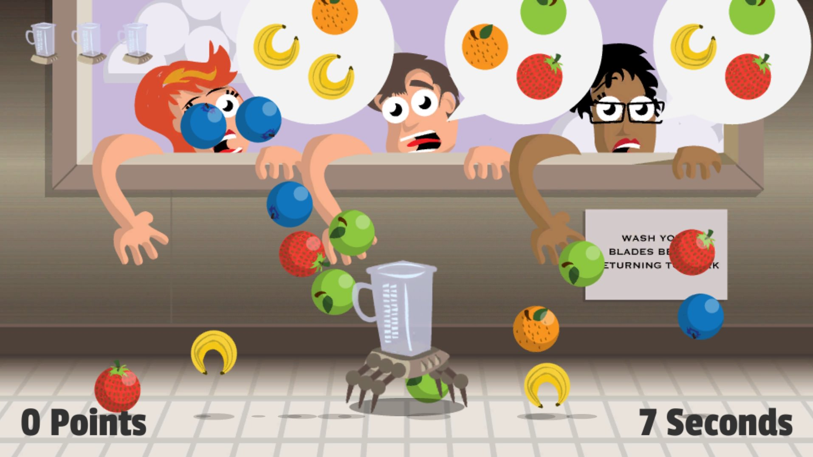

# Smoothie Operator

> 🍊 One robot blender. One flying food truck. Endless customers.

## Intro

In the not-so distant future where food trucks are in such high demand that they needed to take to the skies, people do whatever they can to place orders for smoothies. Whether it's by jetpack, grappling hooks or their natural ability to fly, people are placing a lot of orders. Your job, as this flying food truck's only robotic blender, is to fulfill as many orders as you can before too many customers get angry and leave.

## Screenshots

## Credits

Built for the Purple Monkey Game Jam in March 2015

- Designer - Rich Leonardo of Forge Ahead Studios
- Audio SFX/Music - Oliver Getz
- Developer - Michael Leonardo of Forge Ahead Studios
- Developer - Scott Doxey
- Developer - Travis Beebe
